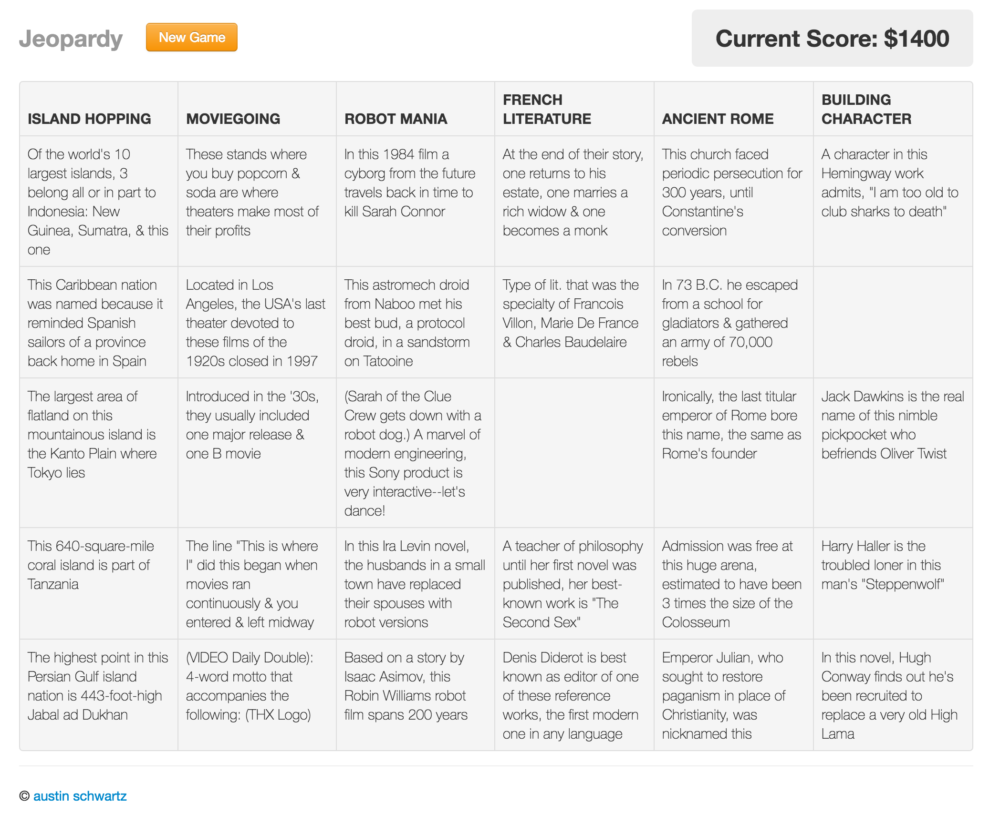

# jeopardy

Simple Angular/Node project for playing randomized jeopardy games. :)

1. Use nvm to switch to node 6.11.2 using `nvm use`

2. Install dependencies with `npm install`

3. Populate the database with `mongorestore dump`

4. Run the app! `npm start` or `node server.js`
